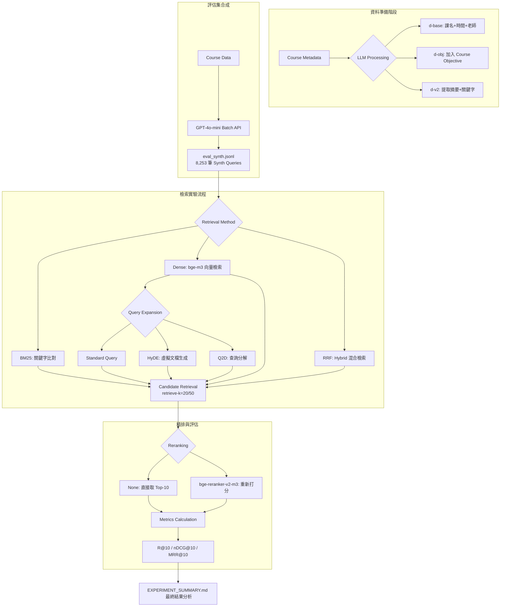

```mermaid
graph TD
    subgraph DataPreparation [資料準備階段]
        A[Course Metadata] --> B{LLM Processing}
        B --> B1[d-base: 課名+時間+老師]
        B --> B2[d-obj: 加入 Course Objective]
        B --> B3[d-v2: 提取摘要+關鍵字]
    end

    subgraph SynthDataset [評估集合成]
        C[Course Data] --> D[GPT-4o-mini Batch API]
        D --> E[eval_synth.jsonl <br/> 8,253 筆 Synth Queries]
    end

    subgraph RetrievalPipeline [檢索實驗流程]
        E --> F{Retrieval Method}
        F --> G1[BM25: 關鍵字比對]
        F --> G2[Dense: bge-m3 向量檢索]
        F --> G3[RRF: Hybrid 混合檢索]
        
        G2 --> H{Query Expansion}
        H --> H1[Standard Query]
        H --> H2[HyDE: 虛擬文檔生成]
        H --> H3[Q2D: 查詢分解]
        
        G1 & G2 & G3 & H1 & H2 & H3 --> I[Candidate Retrieval <br/> retrieve-k=20/50]
    end

    subgraph Ranking [精排與評估]
        I --> J{Reranking}
        J --> J1[None: 直接取 Top-10]
        J --> J2[bge-reranker-v2-m3: 重新打分]
        
        J1 & J2 --> K[Metrics Calculation]
        K --> L["R@10 / nDCG@10 / MRR@10"]
    end

    L --> M[EXPERIMENT_SUMMARY.md <br/> 最終結果分析]
```
