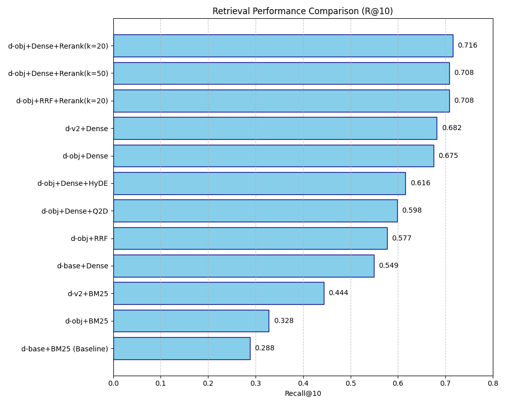

# 實驗結果整理報告

## 1. 實驗結果摘要 (Recall@10)

| 方法 (Configuration) | R@10 | 樣本數 (n) | 備註 |
| :--- | :---: | :---: | :--- |
| **d-base+BM25** | 0.288 | 8253 | 現行系統 Baseline |
| d-obj+BM25 | 0.328 | 8253 | 加入 objective $\rightarrow$ BM25 提升有限 |
| d-v2+BM25 | 0.444 | 500 | LLM Meta 對 BM25 提升明顯 |
| d-base+Dense | 0.549 | 8253 | 純 Dense 基礎表現 |
| d-obj+RRF | 0.577 | 8253 | RRF 融合效果不如純 Dense |
| d-obj+Dense+Q2D | 0.598 | 500 | 查詢擴展 (Q2D) |
| d-obj+Dense+HyDE | 0.616 | 500 | 虛擬文檔 (HyDE) |
| d-obj+Dense | 0.675 | 8253 | **核心收益：Objective $\rightarrow$ Dense** |
| d-v2+Dense | 0.682 | 500 | LLM Meta 對 Dense 邊際效益低 |
| d-obj+RRF+Rerank(k=20) | 0.708 | 500 | Reranker 開始發揮作用 |
| d-obj+Dense+Rerank(k=50) | 0.708 | 500 | $k=50$ 雜訊較多 |
| **d-obj+Dense+Rerank(k=20)** | **0.716** | 500 | **目前最佳配置 (SOTA)** |

## 2. 實驗進度

### 🟢 已完成
- [x] 驗證 `objective` 加入索引為最大收益來源 (+12.6pp)。
- [x] 驗證 Reranker 效果，確定 $k=20 \rightarrow 10$ 為最佳路徑。
- [x] 完成 LLM-synth 評估集 (8,253 query) 的初步跑分。
- [x] 成本優化：全面改用 GPT-4o-mini Batch API ($\approx$ US$1.6)。

### 🟡 進行中 (home_wsl)
- [ ] `d-v2 + dense + rerank(k=20)` $\rightarrow$ 計算分數中。
- [ ] `hyde + dense + rerank(k=20)` $\rightarrow$ 等待排隊。
- [ ] `q2d + dense + rerank(k=20)` $\rightarrow$ 等待排隊。

### 🔴 待處理 (Next Steps)
- [ ] 建立 Human gold-set (150 query) 標注介面 $\rightarrow$ 解決模型偏誤問題。
- [ ] 將最佳配置 (`D-Obj + Dense + Rerank k=20`) port 回 `CourseLangChain`。

## 3. 表現可視化

